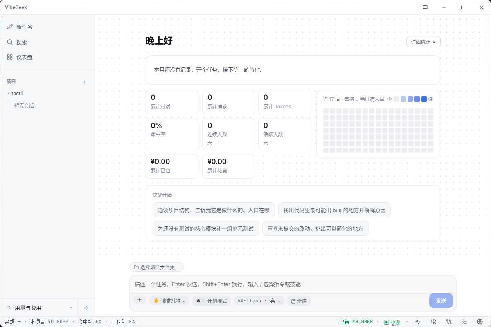

# ⚡ VibeSeek

### DeepSeek 专属的 vibecoding 桌面客户端

<code>📚 全库模式</code> &nbsp; <code>🎨 精致克制的界面</code> &nbsp; <code>🧩 技能零改即用</code> &nbsp; <code>↩️ 改坏一键回滚</code>

简体中文 · <a href="README.en.md">English</a>

> **Windows / macOS 桌面应用,DeepSeek 专属。** 最新版:[下载 v1.0.1 →](https://github.com/getvibeseek/vibeseek/releases/latest)

---

## 💡 为什么是 VibeSeek

VibeSeek 想做好一件事:**让你愿意一直待在里面写代码**。舒服的排版、改坏能立刻退回的安全感、把整个项目交给模型直接定位、花了多少看得见 —— 这些是你每天真正在用的东西。

---

## ✨ 主要功能

| | 功能 | 说明 |
|:--:|---|---|
| 🤖 | **会改代码的助手** | 读文件 / 改代码 / 跑命令,三档权限(只读 · 改动前确认 · 危险操作双确认),还有"先出方案再动手"的计划模式 |
| ↩️ | **改坏不怕** | 每次动手前自动存还原点,一键退回(还原点交互受 Claude Code 启发);每个文件、每段改动都能单独接受或拒绝 |
| 🧩 | **生态即插即用** | 现成的技能一字不改就能用;MCP 工具配一下就接进来 |
| 📚 | **全库模式** | 把整个代码库交给模型,它不用反复翻文件,回答更准 |
| 🧾 | **看得见的花费** | 实时余额、命中率、花了多少;每个任务都有一张可截图分享的**结算小票** |
| 🎛️ | **顺手的细节** | 暗 / 亮 / 跟随系统主题、可拖宽侧边面板、内嵌预览浏览器、跨会话记忆召回 |

---

## 📸 截图

  

新任务首页 —— 省钱概览、累计统计、活跃热力图一屏可见

<!-- 后续补充:文档流对话 · 结算小票(需真实会话数据) -->

---

## 📊 实测

真实 API 跑出来的数(每个用例都把模型产出的代码 **import 进来真跑**验证,完整报告见 **[docs/评测结果.md](docs/评测结果.md)**):

| 维度 | 结果 |
|---|---|
| 🎯 **编程任务通过率** | **100%** — 32 例 × auto/flash/pro 三模式 × 2 轮,全过 |
| 💰 **自动路由省钱** | 用纯 pro **约 40% 的成本**拿到同等结果(省 ~60%) |
| 📚 **全库模式** | **72/72 改对,检索调用 0 次** — 直接从全库定位,不翻文件 |
| ⚡ **缓存命中** | 日常会话 **90–95%**,大型项目 / 全库 **99%+** |

📌 命中率如实分场景:小型一次性任务约 88–90%(每次新增内容无法缓存,是数学下限),会话越长、项目越大越高。

---

## 📥 安装

- **Windows**:[最新 Release](https://github.com/getvibeseek/vibeseek/releases/latest) 里的 `VibeSeek-Setup-*.exe`(x64)。未签名,首次运行 SmartScreen 可能提示——点「更多信息 → 仍要运行」即可。
- **macOS**:同页的 `VibeSeek-*-arm64.dmg`(Apple Silicon)。未签名,首次打开请右键点「打开」,或在「系统设置 → 隐私与安全性」中允许;也可在终端执行 `xattr -dr com.apple.quarantine /Applications/VibeSeek.app`。
- 下载后可用同页的 `SHA256SUMS.txt` 校验完整性。

### 关于改动备份

「一键回滚到任务前」依赖系统已安装 Git;逐文件 / 逐段的接受、拒绝改动不受影响,始终可用。

- 未安装 Git:仅「一键回滚」不可用,其余功能照常。
- Windows:安装 [Git for Windows](https://git-scm.com/download/win)(保持默认选项即可,会自动加入 PATH)。
- macOS:终端运行 `xcode-select --install`,或用 Homebrew 执行 `brew install git`。

---

## 🙏 致谢

VibeSeek 站在这些前人工作的肩上:

- **[Reasonix](https://github.com/esengine/deepseek-reasonix)** — 缓存优先的 agent 设计思路给了我们启发
- **[DeepSeek-GUI](https://github.com/XingYu-Zhong/DeepSeek-GUI)** — 缓存优化的开放工程参考
- **[MiMo-Code](https://github.com/XiaoMi/MiMo)** — 持久记忆架构(checkpoint + 全文召回)
- **[Claude Code](https://claude.ai/code)** — 交互模型与权限系统的设计参考

本项目未直接复制任何第三方代码;字体与图标许可见 **[THIRD-PARTY-NOTICES.md](THIRD-PARTY-NOTICES.md)**。

参与开发请见 <a href="CONTRIBUTING.md">CONTRIBUTING.md</a>

---

